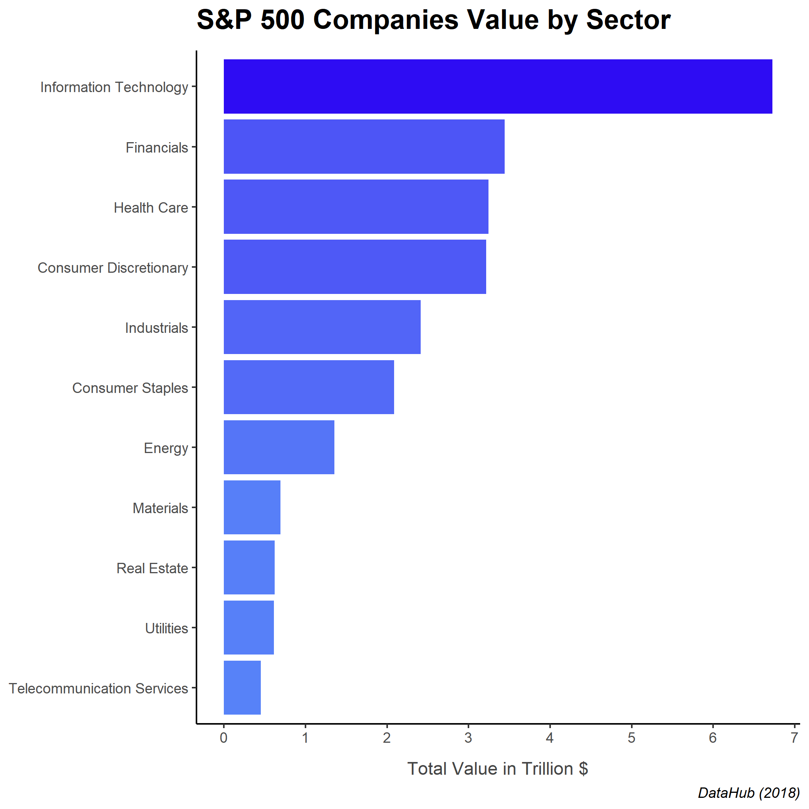

The Standard and Poor's 500, or simply the S&P 500, is a stock market index tracking the stock performance of 500 large companies listed on exchanges in the United States. This means that the S&P 500 gives a broad overview of how the US economy is doing at any point in time. It is one of the most commonly followed equity indices. Alternatives include Dow Jones Industrial (DJIA), Nasdaq Composite (COMP), and Vanguard Total Stock Market Index Fund Admiral Shares (VTSAX). *(Wikpedia)*  
&nbsp;  
&nbsp;
```{r setup, include=FALSE}
knitr::opts_chunk$set(echo = FALSE)
library(tidyverse)
library(rvest)
library(janitor)
library(distill)
library(ggplot2)
library(readr)
library(plotly)
library(knitr)
```

```{r}
raw_data = read_csv(file = "constituents-financials.csv")

market_cap_by_sector = raw_data |> 
  clean_names() |> 
  select(sector, market_cap) |> 
  group_by(sector) |> 
  summarize(total_value = sum(market_cap)) |> 
  mutate(total_value = total_value / 1000000000000) |> 
  arrange(desc(total_value))

ggplot(data = market_cap_by_sector,
       mapping = aes(x = fct_reorder(sector, total_value),
                     y = total_value,
                     fill = total_value)) +
  geom_col() +
  scale_y_continuous(breaks = c(0:8)) +
  coord_flip() + 
  scale_fill_gradient(low = "#5782f8", high = "#2e0cf3") +
  labs(title = "S&P 500 Companies Value by Sector",
       x = NULL,
       y = "Total Value in Trillion $",
       caption = "DataHub (2018)") +
  theme_classic() +
  theme(legend.position="none",
        plot.title = element_text(face = "bold", size = 17, margin = margin(b = 10)),
        axis.title.x = element_text(margin = margin(t = 10), color = "#454545"),
        plot.caption = element_text(face = "italic"))

#ggsave("market_cap_graph.png", market_cap_graph)

#
```

# Analysis

Information Technology has been a dominating sector in the world economy for years and is continuing to grow at an explosive rate. As seen in the graphic below, many of the top companies (in terms of value) are closely related to the tech industry (four out of five are FAANG). There is an increasing demand for new technology as people move toward the middle class. The world is becoming more advanced and modernized, which is why the Information Technology market will remain ginormous and keep expanding as well.  

#### \
```{r}
top_10 = read_csv("wikipedia_top_10_2.csv") |> 
  mutate(company = paste0(" (", symbol, ")")) |> 
  mutate(market_cap = market_cap / 1000000000000)

ggplot(data = top_10,
       mapping = aes(x = fct_reorder(company, desc(market_cap)), y = market_cap, fill = market_cap)) +
  geom_col() +
  scale_fill_gradient(low = "#5782f8", high = "#2e0cf3") +
  theme_classic() +
  theme(axis.text.x = element_text(angle = 30, hjust = 0.5, vjust = 0.5),
        plot.caption = element_text(face = "italic", margin = margin(t = 15)),
        plot.title = element_text(face = "bold", size = 17, margin = margin(b = 10)),
        legend.position="none") +
  labs(title = "Top 10 Companies in S&P 500",
       x = NULL,
       y = "Market Cap in Trillion $",
       caption = "Wikipedia (2022)")

```